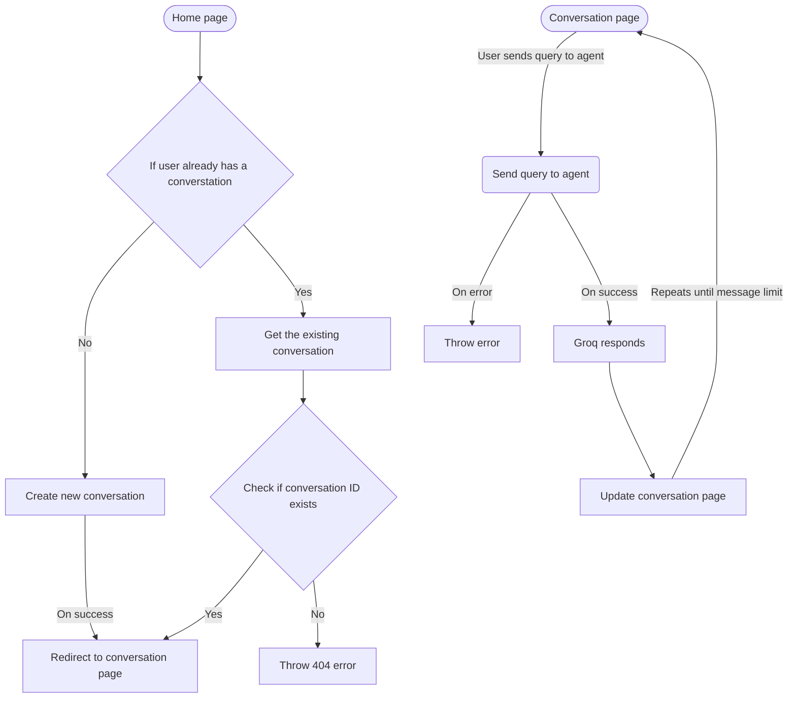

### Why Bun?
Bun has a faster build and runtime and it has a built-in SQLite DB faster than __better-sqlite3__.

### Tech stack
- [Bun](https://bun.sh/) as package manager and [SQLite provider](https://bun.com/docs/runtime/sqlite#sqlite)
- [SvelteKit](https://svelte.dev/)
- [GroqLLM](https://groq.com/)

### Why Groq as LLM?
- Because, ChatGPT, Claude and Gemini provide API_TOKEN with a paid subscription. Groq was one of the reliable and fast LLM that provides API_TOKEN without a paid subscription and it had a well build SDK for TypeScript.
- Prompt provided for Groq https://github.com/Ja4V8s28Ck/Spur/blob/586b0a401cc95bb3fb86aacb0e0f40badc506492/src/lib/server/groq.ts#L16-L43
- To provide best responses, I feed the last 6 interactions between the Agent and User to the LLM to get the best answer within context.

### Design

### Database Schema

### What could I have done better?
An interesting case, when the agent starts generating text and the user reloads the page while _Agent is typing_ message, it vanishes and after a couple of reloads we can see the generated response. I believe this could be solvable with redis (_not sure as I haven't tried it yet_), but adding redis means we should have a redis server up and running and time is of the essence. So I tried the same thing in **ChatGPT** and tried how it responds. Weirdly, it responds the same as the my project.

| ChatGPT | This App |
|---------|----------|
| <video src="https://github.com/user-attachments/assets/612f11b0-ff7d-432f-8803-230302f53ba9" /> | <video src="https://github.com/user-attachments/assets/663f57ea-5858-4047-9aa7-3bc08eafdd7d" /> |

### How to run the project locally?
- Rename `.env.example` to `.env` and populate it.
- Run `bun i` to install dependencies.
- Run `bun drizzle:generate; bun drizzle:migrate` for generating schema files and migrate it to db.
- Finally `bun run dev` to run the project locally or `bun run build; bun run preview` to preview the production build. 

### Production deployment
[Link](https://spur-latest.onrender.com). Deployed via _docker_ in __Render__ because bun had some issues building and running the project in node enviroment. Using Docker deploy made the entire process hassle free.

### Short video on the working
<video src="https://github.com/user-attachments/assets/4cade616-5602-4efd-862d-f95ed2f300b6" />
